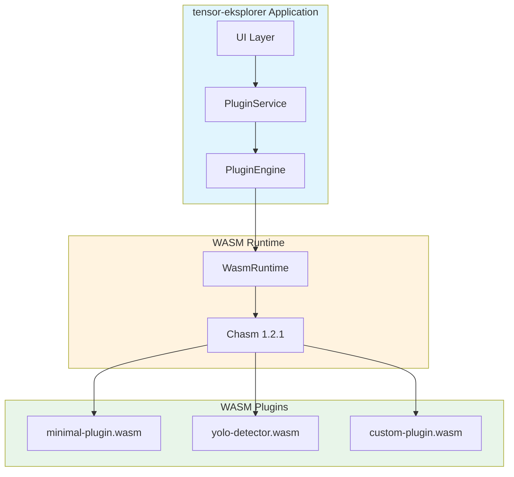
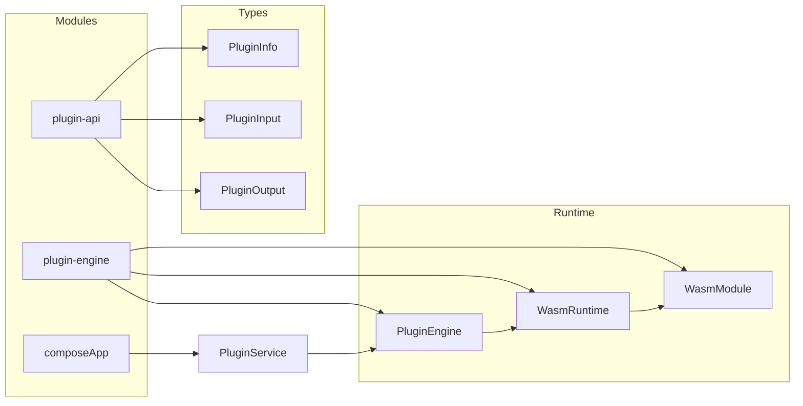
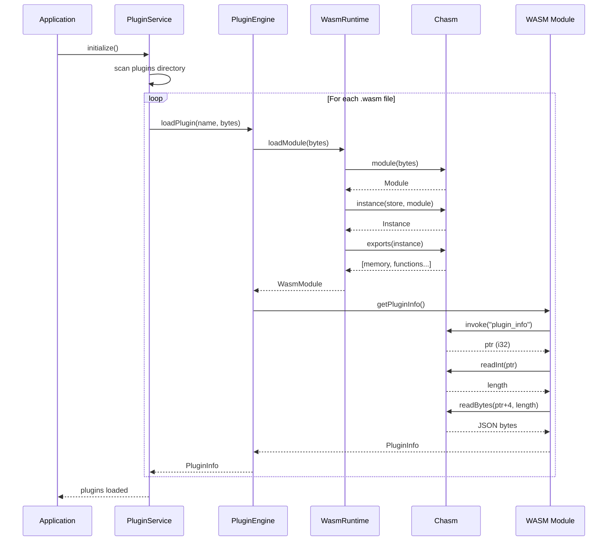
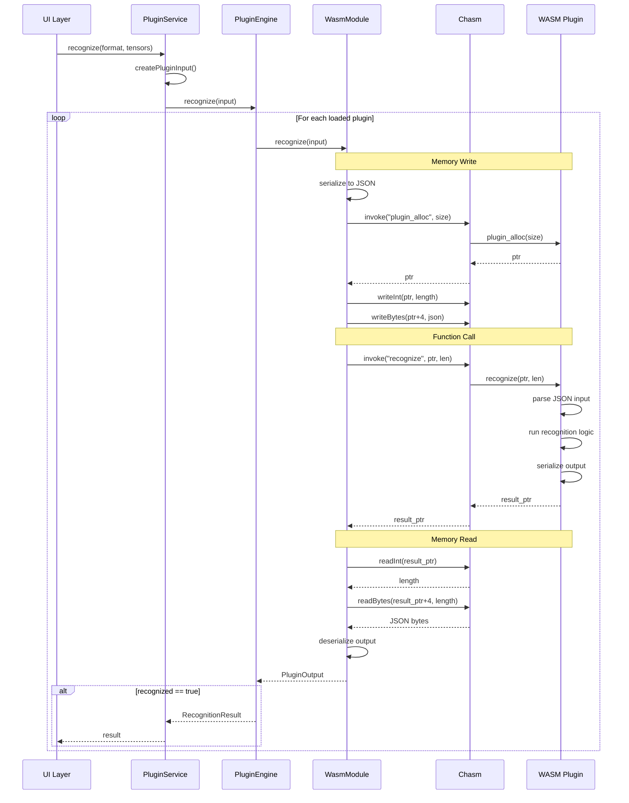
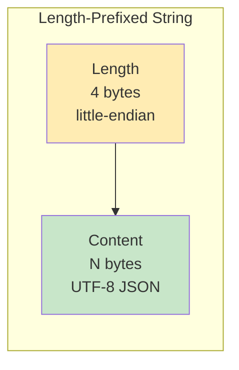
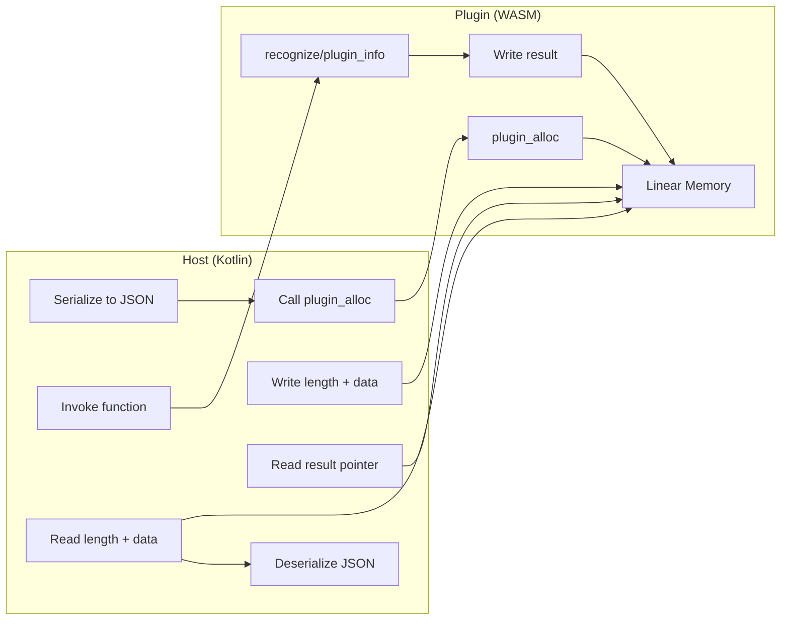
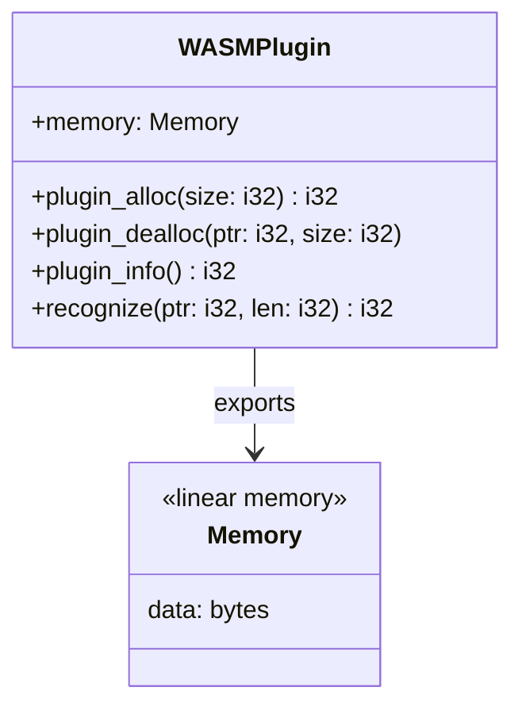
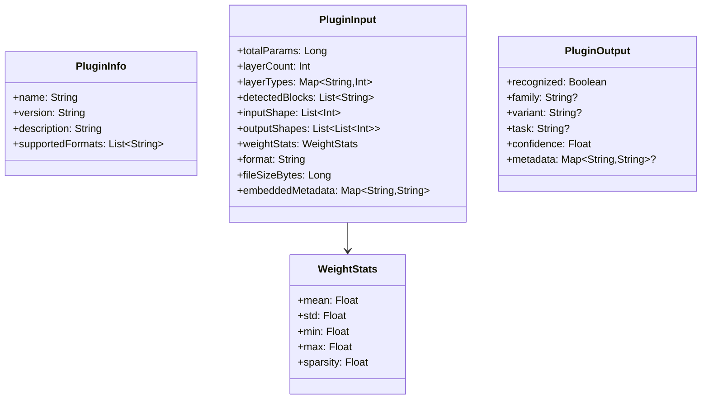
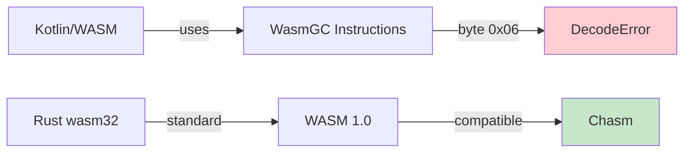

# Plugin Architecture
Evalute posibility to run KMP apps with WASM based plugins.

## Technology Stack

| Component | Technology | Version | Link |
|-----------|------------|---------|------|
| WASM Runtime | Chasm | 1.2.1 | [GitHub](https://github.com/CharlieTap/chasm) |
| Host Language | Kotlin Multiplatform | 2.3.0 | [kotlinlang.org](https://kotlinlang.org) |
| Plugin Language | Rust | 1.75+ | [rust-lang.org](https://rust-lang.org) |
| WASM Target | wasm32-unknown-unknown | - | - |
| Serialization | kotlinx.serialization | 1.7.3 | [GitHub](https://github.com/Kotlin/kotlinx.serialization) |

## Architecture Overview



## Project Structure



### Directory Layout

```
tensors-eKsplorer/
├── plugin-api/                          # Shared types (KMP)
│   └── src/commonMain/kotlin/
│       └── ai/skainet/eksplorer/plugin/
│           ├── PluginInfo.kt            # Metadata type
│           ├── PluginInput.kt           # Recognition input
│           ├── PluginOutput.kt          # Recognition output
│           └── PluginSerializer.kt      # JSON codec
│
├── plugin-engine/                       # WASM runtime (KMP)
│   └── src/commonMain/kotlin/
│       └── ai/skainet/eksplorer/plugin/engine/
│           ├── WasmRuntime.kt           # Chasm wrapper
│           └── PluginEngine.kt          # Plugin manager
│
├── composeApp/                          # Desktop app
│   └── src/jvmMain/kotlin/.../plugins/
│       └── PluginService.kt             # App integration
│
├── rust-plugin-example/                 # Reference plugin
│   ├── src/lib.rs
│   ├── Cargo.toml
│   ├── Dockerfile
│   └── build.sh
│
├── chasm-test-cli/                      # Debug tool
│   └── src/main/kotlin/ChasmTest.kt
│
└── plugins/                             # Compiled .wasm files
    └── minimal-plugin.wasm
```

## Data Flow

### Plugin Loading Sequence



### Model Recognition Flow



## Memory Exchange Protocol

### Data Format



### Memory Layout Example

```
Offset    0    1    2    3    4    5    6    7   ...   N+3
        ┌────┬────┬────┬────┬────┬────┬────┬────┬─────┬────┐
        │ 8C │ 00 │ 00 │ 00 │ 7B │ 22 │ 6E │ 61 │ ... │ 7D │
        └────┴────┴────┴────┴────┴────┴────┴────┴─────┴────┘
         └──────────────┘    └────────────────────────────┘
          Length = 140        JSON: {"name":"..."...}
          (little-endian)
```

### Host ↔ Plugin Communication



## Plugin Interface

### Required Exports



| Export | Signature | Description |
|--------|-----------|-------------|
| `memory` | `Memory` | Linear memory for data exchange |
| `plugin_alloc` | `(i32) -> i32` | Allocate N bytes, return pointer |
| `plugin_dealloc` | `(i32, i32) -> void` | Free memory at ptr with size |
| `plugin_info` | `() -> i32` | Return pointer to JSON metadata |
| `recognize` | `(i32, i32) -> i32` | Process input, return result pointer |

### Data Types



### JSON Examples

**PluginInfo:**
```json
{
  "name": "Minimal Rust Plugin",
  "version": "0.1.0",
  "description": "A minimal example plugin written in Rust",
  "supportedFormats": ["onnx", "gguf"]
}
```

**PluginInput:**
```json
{
  "totalParams": 3200000,
  "layerCount": 225,
  "layerTypes": {"Conv": 53, "BatchNorm": 52, "SiLU": 51},
  "detectedBlocks": ["C2f", "SPPF", "Detect"],
  "inputShape": [1, 3, 640, 640],
  "outputShapes": [[1, 84, 8400]],
  "weightStats": {"mean": 0.0, "std": 0.1, "min": -1.0, "max": 1.0, "sparsity": 0.0},
  "format": "onnx",
  "fileSizeBytes": 6500000,
  "embeddedMetadata": {}
}
```

**PluginOutput:**
```json
{
  "recognized": true,
  "family": "YOLO",
  "variant": "v8n",
  "task": "detect",
  "confidence": 0.95,
  "metadata": {"detected_by": "minimal-rust-plugin"}
}
```

## Usage

### Loading Plugins

```kotlin
// Initialize on app startup
PluginService.initialize()

// Or load from custom directory
PluginService.initialize(File("/path/to/plugins"))

// Check loaded plugins
val plugins = PluginService.getLoadedPlugins()
plugins.forEach { (name, info) ->
    println("${info.name} v${info.version}")
}
```

### Running Recognition

```kotlin
// From model analysis
val result = PluginService.recognize(
    format = ModelFormat.ONNX,
    tensors = analyzedTensors,
    metadata = modelMetadata
)

if (result != null && result.recognized) {
    println("Detected: ${result.family} ${result.variant}")
    println("Task: ${result.task}")
    println("Confidence: ${result.confidence}")
}
```

### Building a Plugin

```bash
# Clone the example
cp -r rust-plugin-example my-plugin
cd my-plugin

# Edit src/lib.rs with your logic

# Build with Docker
./build.sh

# Install
cp my-plugin.wasm ~/.tensor-eksplorer/plugins/
```

## Lessons Learned

### 1. Kotlin/WASM Incompatibility



**Problem:** Plugins compiled with Kotlin/WASM fail with `DecodeError(UnknownInstruction(byte=6))`.

**Cause:** Kotlin/WASM uses WasmGC proposal instructions that Chasm cannot decode.

**Solution:** Use Rust with `wasm32-unknown-unknown` target.

### 2. No Built-in String Passing

**Problem:** Chasm has no high-level API for passing strings between host and guest.

**Solution:** Implemented length-prefixed protocol with manual memory management:
- `plugin_alloc` / `plugin_dealloc` for memory
- `writeInt` + `writeBytes` for writing
- `readInt` + `readBytes` for reading

### 3. Memory API Discovery

**Problem:** Chasm memory APIs not documented.

**Solution:** Found in source code:
```kotlin
import io.github.charlietap.chasm.embedding.memory.readInt
import io.github.charlietap.chasm.embedding.memory.readBytes
import io.github.charlietap.chasm.embedding.memory.writeInt
import io.github.charlietap.chasm.embedding.memory.writeBytes
```

### 4. Java Version Mismatch

**Problem:** `UnsupportedClassVersionError` across modules.

**Solution:** Consistent toolchain in all `build.gradle.kts`:
```kotlin
kotlin {
    jvmToolchain(21)
}
```

## Debugging

### chasm-test-cli

Test plugins directly:

```bash
cd chasm-test-cli
./gradlew run --args="../plugins/minimal-plugin.wasm"
```

Output:
```
=== Module Exports ===
  memory: Memory
  plugin_alloc: Function
  plugin_dealloc: Function
  plugin_info: Function
  recognize: Function

=== Calling plugin_info ===
Pointer value: 1114536 (0x1101a8)
Length prefix: 140 bytes

Plugin Info JSON:
{"name":"Minimal Rust Plugin","version":"0.1.0",...}
```

### Inspecting WASM Files

```bash
# List exports
wasm-objdump -x plugin.wasm | grep -A20 "Export"

# Check for Kotlin/WASM (will contain "kotlin" in imports)
wasm-objdump -x plugin.wasm | grep -i kotlin
```

## References

| Resource | Link |
|----------|------|
| Chasm Repository | https://github.com/CharlieTap/chasm |
| Chasm Memory API | [source](https://github.com/CharlieTap/chasm/tree/main/chasm/src/commonMain/kotlin/io/github/charlietap/chasm/embedding/memory) |
| WebAssembly Spec | https://webassembly.github.io/spec/core/ |
| Rust WASM Book | https://rustwasm.github.io/docs/book/ |

---

*Last updated: 2025-01-25 | Plugin System v1.0.0*
